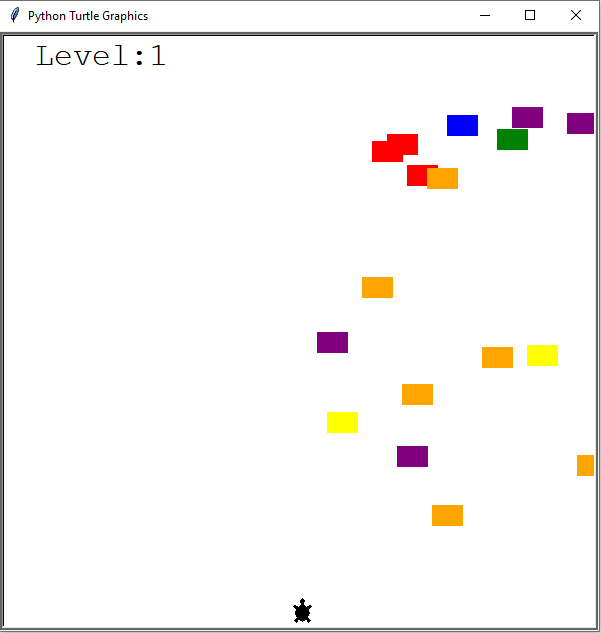

# 🐢 Crossing Turtle Game

A beginner-friendly arcade-style game built using the Python Turtle graphics library.  
The player controls a turtle that must cross the screen while avoiding moving cars.

---

## 🎮 Gameplay

- Press the **Up arrow** to move the turtle forward.
- Dodge the cars and reach the top of the screen to level up.
- Each level increases the cars' speed.
- The game ends if the turtle collides with a car.

---

## 📷 Preview

---

## 📚 What I Learned

- How to structure a Python project using **Object-Oriented Programming**
- Creating and managing multiple objects with shared behavior (`CarManager`)
- Managing game state with a main game loop
- Simple collision detection using `.distance()`
- Event handling with `onkeypress()` from the `turtle` module
- Efficient screen updates using `.tracer()` and `.update()`

---
This is a small project created while following Angela Yu’s 100 Days of Code Python course.
The main goal was to practice class design, game loops, and the use of Turtle graphics.
